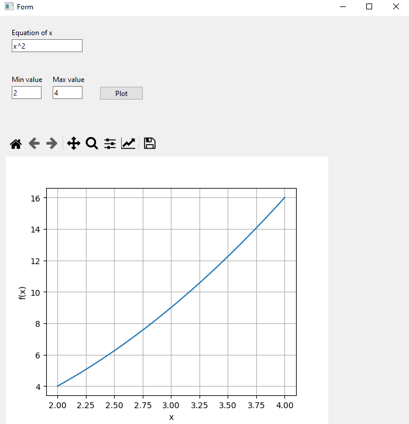

# Function Plotter Project
Function Plotter Project is GUI program that plots given function of x implemented using python and pyQt framework

## Requirements

  * Python 3.7 or newer
  * libraries: PySide6, numpy, matplotlib

